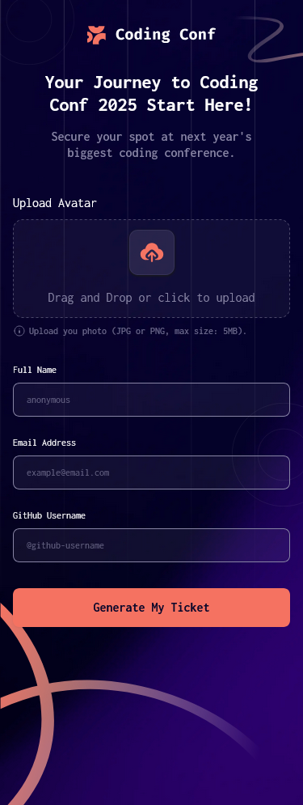

# Conference ticket generator

This is a solution to the [Conference ticket generator challenge on Frontend Mentor](https://www.frontendmentor.io/challenges/conference-ticket-generator-oq5gFIU12w).

In this challenge, we are tasked with creating a simple ticket generator website for a conference. The ticket is generated based on the attendee's name, email, github username, and his/her avatar image collected from the form.

## Features

- Attendees can complete the form with their details:

  - Name
  - Email
  - GitHub username
  - Avatar image

- Full form validation messages if:

  - Any field is missed
  - The email address is not formatted correctly
  - The avatar upload is too big or the wrong image format

- Users can drag and drop or click to upload an avatar image.

- Complete the form only using their keyboard

- Have inputs, form field hints, and error messages announced on their screen reader

- See the generated conference ticket when they successfully submit the form

- View the optimal layout for the interface depending on their device's screen size

- See hover and focus states for all interactive elements on the page

### Screenshot

### Links

- Solution URL: [Github Link](https://your-solution-url.com)
- Live Site URL: [ticket-gen](https://confticketgen.vercel.app)

### Technologies Used

- [Vite](https://vitejs.dev/)
- [React JS](https://reactjs.org/)
- [Tailwind CSS](https://tailwindcss.com/)
- [Typescript](https://www.typescriptlang.org/)

## Author

- Github - [@ahmadyousif89](https://github.com/ahmadyousif89)
- Frontend Mentor - [@AhmadYousif89](https://www.frontendmentor.io/profile/AhmadYousif89)
